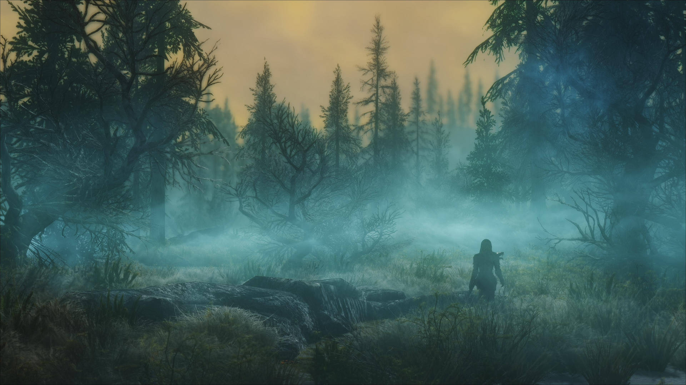

# Forêt

Vous vous retrouvez dans une forêt de chênes et de boulot. Vous entendez des oiseaux et d'autres animaux.
Malheuresement dû à la brume et au manque de lumière vous ne voyez pas bien loin.

[Aller à la montagne](Montagne.md)
[Aller à la plaine](plaine.md)
[Aller au canyon](canyon.md)

Auteur : Vincent Bassemayousse